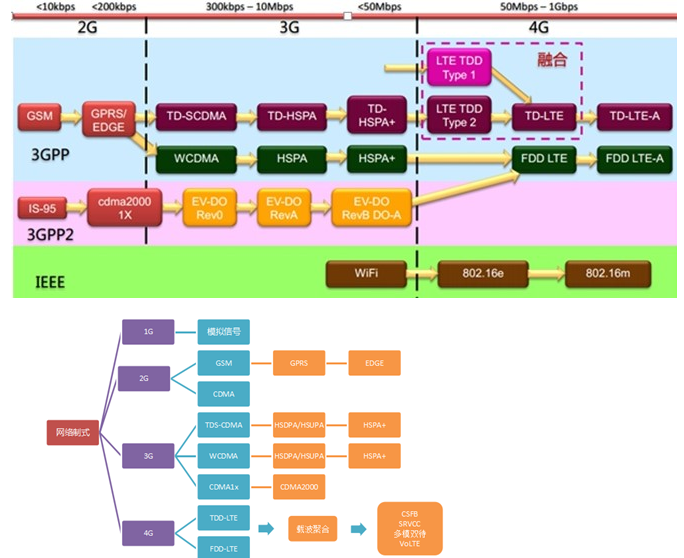
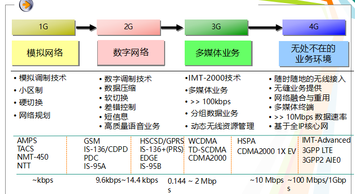
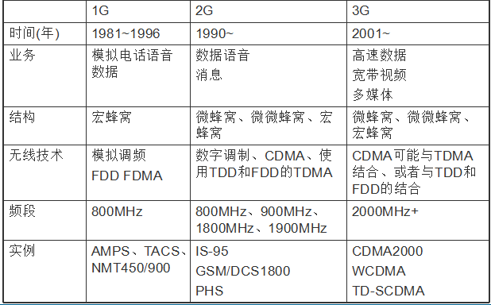
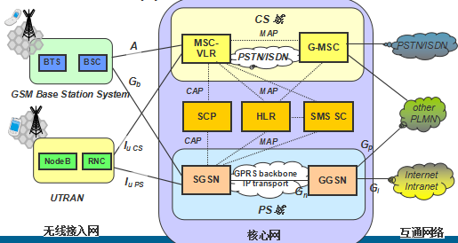
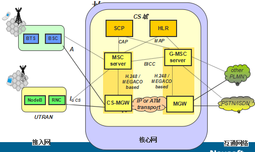
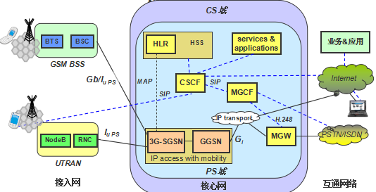
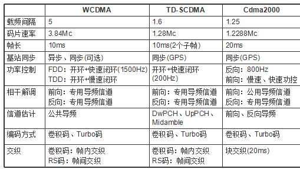
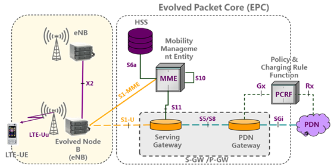
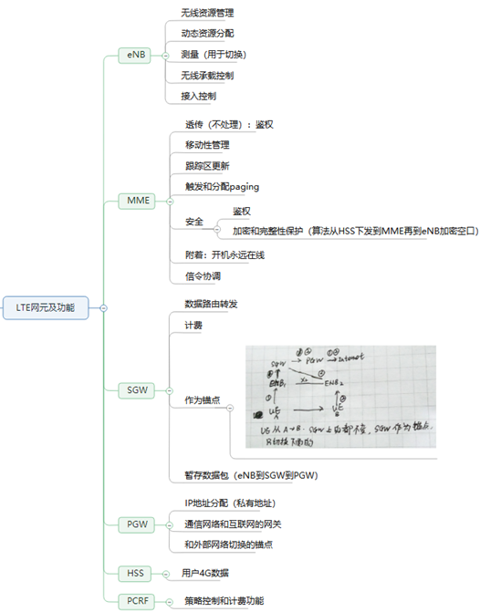
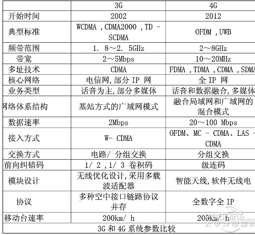

[TOC]

# 一、移动通信发展概述

## 1.1 第一代蜂窝系统（G）
+ AMPS (美国)
+ TACS（英国）
+ NMT （北欧）

## 1.2 第二代蜂窝系统（2G）
+ GSM/DCS1800 (欧洲)
+ IS-95 CDMA  (美国)

## 1.3 第三代蜂窝系统（3G）
+ WCDMA（联通）
+ CDMA2000
+ TD-SCDMA（移动，2009我国主导的）

## 1.4 第四代蜂窝系统（4G）
LTE TDD Type（type指的是无线帧）TD-LTE（不是真正意义上的4G，是3.9G最大部分保留了WCDMA和TD-SCDMA的特性）TD-LTE-A 和FDD LTE-A（才是真正意义的4G）


发展趋势：模拟向数字的发展，语音业务向多媒体业务的发展  



# 二、21世纪通信的重大变革

## 2.1 20 世纪
+ 以音频为主的单媒体
+ 微波/光纤
+ 有线/无线
+ PDH/SDH
+ STM/IPv4

## 2.2 21 世纪
+ 以流业务为主的多媒体
+ 光纤/微波
+ 无线/有线
+ SDH/PDH
+ ATM/IPv6

## 2.3 无线宽带多媒体通信系统
+ 无线IP和有线ATM
+ 无线通信和互联网/多媒体通信相结合

# 三、移动通信主要技术
```
			      干扰
				|
				V
信息编码 -> 信道编码 -> 调制 -> 信道 -> 解调 -> 信道译码 -> 信源译码
```

## 3.1 移动通信的主要特点
### 3.1.1 无线传输损耗模型
+ 路径损耗
+ 阴影衰落（慢衰耗）
+ 多径衰落（快衰耗）

+ 资源紧张：日益增长的用户数和有限频谱资源的矛盾
+ 环境恶劣：用户对业务质量的需求和无线传播环境的矛盾

## 3.2 切换技术
a. 按切换期间同时连接的基站数目分：  

* 硬切换（不足： 容易掉话）
* 软切换（更软切换）（缺点： 浪费资源）
* 接力切换

b. 按控制方式分：

+ 网络控制切换
+ 移动设备控制切换
+ 移动设备辅助切换
+ 网络辅助切换

c. 按进行切换需要交换的信息资源分：

+ 后向切换
+ 前向切换

## 3.3 无线通信的传播信道特征
+ 无线传播环境的复杂性： 天波（电离层、对流层）、地波（直射、反射、衍射、透射等）

+ 信道的分类：
	- 带宽受限信道和功率受限信道
	- 非色散信道和色散信道
	- 恒参信道和变参信道
	- 点对点信道和多址信道

## 3.4 移动通信网络结构
+ 移动终端：多模式、多频段、多样化的终端
+ 无线接入网：包括RNC、NodeB等，实现无线传输和控制功能
+ 核心网络：包括MSC、HLR、VLR、SGSN、GGSN等，提供信息交换和传输、控制
+ 电脑交换网络：PSTN
+ IP网络

### 3.4.1 大区制和小区制

### 3.4.2 蜂窝小区
+ 不单纯分割频段
+ 通过分割地理区域
+ 更加有效的使用无线频率

# 四、2G/2G+/3G网络架构
## 4.1 2G
### 4.1.1 GSM网络
a. FDD/TDMA  

b. GSM在单一数字电路交换平台上，完成数字式语音与同一低速率电路交换的数据业务
### 4.1.2 结构和网络实体
- 基站子系统（BBS）：负责提供和管理移动台与网络和交换子系统设备间的传输路径。
- 基站控制器（BSC）：管理设备，控制BST，负责所有的无线接口管理，主要是无线信道的分配、释放及切换管理。
- 基站收发台（BST）: 是传输设备，包括无线射频和接收设备、无线及所有无线接口特有的信号处理设备。
- 网络和交换子系统（NSS）： 管理GSM用户和其它电信网络用户之间的通信。
- 移动业务交换中心（MSC-Mobile Switch Center）: 完成GSM网络的交换功能，实现GSM网络用户与其他通信网用户的呼叫的接续。处理目前处在它所管辖区中的移动用户的通信业务，又通过局间中继线路与固定网长途局、市话汇接局以及其他MSC相连。
- 访问位置寄存器（VLR-Visited Location Register）: 是一个数据库，与一个或多个MSC相连，负责存储MSC管辖区域范围内移动用户的注册信息（例如用户号码，所处位置区的识别，向用户提供的服务等参数）。通常VLR与MSC合设于一个物理实体。
- 归属位置寄存器（HLR-Home Location Register）: 是数字蜂窝移动通信系统的数据中心系统，它存储着固定区域内所有归属移动用户的标识信息、位置信息、业务数据等信息。通过七号信令网与移动通信网的其它功能实体（如MSC、VLR）进行信息的交互，可实时地提供对用户位置信息的查询和修改，及实现一系列业务操作，完成移动通信网中用户移动性管理。
- 鉴权中心（AuC-Authentication Center）: 为移动用户的身份确认管理安全数据，包括相应的鉴权参数（随机数RAND，符号响应SRES，密钥Kc）的产生和管理。AC一般与HLR一起实现。
- 设备识别寄存器（EIR-Equipment Identify Register）: 存储有关移动台设备参数的数据库。主要完成对移动设备的识别，监视，闭锁等功能。
- GSM业务控制实体（gsmSCF）: gsmSCF存储了相应智能业务的业务控制逻辑，实现对移动智能业务的灵活控制。专门实现gsmSCF功能的物
理实体可以称为SCP(存储有关CAMEL的业务逻辑，参与控制呼叫。)。

注：2G通信系统采用3G网络架构，即BTS（BBU和RRU）-BSC-核心网。2G核心网同时包含CS域和PS域。

BBU主要负责基带处理和协议栈处理等。  
RRU主要负责跟射频相关的模块，包括4大模块：中频模块、收发信机模块、功放和滤波模块。  
BBU和RRU之间采用光纤连接 

## 4.2 什么是2G+
- 2G+是在电路（CS）交换平台之外再建设一个分组（PS）交换平台，承担分组交换的各类数据业务服务：
	+ 通用分组无线电业务（GPRS）
	+ GSM演进增强型数据速率（EDGE）

### 4.2.1 GPRS网络架构
- SGSN：与BSS接口，与GSM网中王媛MSC/VLR功能类似，为MS提供分组数据服务
- GGSN： 负责提供GPRS网与外部分组数据网络的接口。

### 4.2.2 GPRS网络的接口
- Gb：BSS和SGSN之间的接口，提供移动性管理和安全管理功能

### 4.2.3 EDGE
- EDGE采用了新的调制技术和新的信息编码，可以用于传输分组交换（PS）和电弧交换（CS）数据/语音。
	+ EDGE网络结构与GPRS网络的体系结构基本相同
	+ 允许在GPRS现有网络软、硬件架构改动不大的情况下，在现有频段上支持GSM向IMT2000/UMTS演进
	+ 3GPP 已经标准化EDGE，即GERAN

## 4.3 3G
### 4.3.1 IMT2000(International Mobile Telecommunications-2000)
+ 1985年ITU（国际电联）提出FPLMTS
+ 1996年正式更名为IMT2000
+ 特点：
	1. 全球漫游（陆地 + 卫星）
	2. 与2G后向兼容
	3. 经济、灵活的接入
	4. 高速数据业务/多媒体
	5. 电路/分组交换
	6. 高的系统容量
	7. 保证高的业务质量
	8. IMT-2000家族内兼容
	9. 与固网融合

### 4.3.2 为什么发展IMT-2000
+ 现有的第二代数字移动通信系统的不足
	- 频谱利用率不够高-容量问题
	- 传输速度较低 - 业务单一
	- 存在多个标准 - 无法实现全球漫游

+ 憧憬： 任何人、在任何地点、任何时间与其他任何人进行任何方式的通信

### 4.3.3 3G的目标
+ 主要目标：
实现移动通信的全球化、业务综合化和通信个人话

注：3G通信系统同样采用3G网络架构，即NodeB（BBU和RRU）-RNC-核心网。3G核心网同时包含CS域和PS域

# 五、3G国际标准化格局
a. 3GPP
- 制定基于GSM/GRPS核心网、全IP核心网，无线技术为WCDMA、TD-SCDMA和EDGE的技术规范

b. 3GPP2
- 制定基于ANSI-41核心网、全IP核心网，无线技术为CDMA2000的技术规范

## 5.1 3GPP通信标准演进
+ R99： 2000年3月完成
	- 新增无线接口
	- 新的RAN接口（如RNC、Node B、切换等）
	- lu、lub、lur接口均基于ATM方式
+ R4 ： 2001年3月完成
	- 移动软交换体系: 控制与承载分离（MSS/MGW）
	- 低码片速TDD（1.28Mcps）
	- 无论是信令部分还是语音部分都可以用ATM或IP承载
	- 流体传输（实时视频的检索）、多媒体消息传输
+ R5 : 2002年6月完成
	- 增加多媒体子系统（IMS域）
	- 实现全IP网络，包括基于SIP的多媒体业务
	- HSDPA
+ R6 : 
	- 引入了MIMO、MUD等
	- 新的业务如MBMS、Presence、支持Push等
	- 增加功能和扩展

## 5.2 3GPP: R99网络结构


R99网络中的网元  

+ 无线接入网络包括两类功能实体： Node B/RNC
	
	- Node B与BTS功能类似  
	- RNC与BSC功能类似  
	- 接入网内部接口基于ATM  

+ 其它已有的功能实体功能扩展（SGSN、GGSN）

## 5.3 3GPP： R4网络结构


R4核心网新增网络实体

+ R4核心网中新增设备（主要发生在电路域）包括：

	- MSC服务器（MSC Server）: 它独立于底层承载协议，主要实现呼叫控制、
	移动性管理、媒体网关接入控制等主要功能。  
	- GMSC服务器（CMSC Server）： 与MSC服务器的功能基本相似；  
	- 媒体网关（MGW）：主要功能是将一种网络中的媒体能换成另一种网络所要求的媒体格式（媒转换和帧协议转换）  

## 5.4 3GPP: R5概述

+ R5的工作集中在业务侧——基于IP多媒体子系统（IMS），完成路由选取以及多媒体会话等功能；
+ 在传统的电路交换域（CS域）和分组交换域（PS域），其架构保持不变
+ 为解决IP管理问题IMS引入了IPv6
+ 随着R5的完成，将为全IP网络的提供一个可以开始建设的基础。



## 5.5 3GPP：R6概述
+ R6网络结构没有太大变更，增加了一些新的功能特性以及对已有功能特性的增强：

	- 支持不同频率的UMTS；
	- 多输入/多输出(MIMO)天线，包括实现技术；
	- 基于PS、IMS的紧急呼叫业务；
	- IMS phase II；
	- MBMS：网络需要增加新的多播广播中心功能实体
	- Presence：实时了解用户的状态和可及性等信息；
	- WLAN-UMTS互通；
	- 。。。

# 六、3G移动通信系统
## 6.1 CDMA 2000
+ CDMA2000的第一阶段成为1x，比1x更高的CDMA2000技术进展包括1xEv（高速数据速率）
+ CDMA 2000 的网络组织方式为模块化方式

### 6.1.1 无线部分
+ 采用前向功率控制、TURBO码等新技术

### 6.1.2 电路交换部分
+ 采用传统的电路交换方式

### 6.1.3 分组交换
+ 以IP技术为基础的网络结构

## 6.2 WCDMA
### 6.2.1 WCDMA（FDD/DS-CDMA）
+ 接收机可获取的信道信息较多，可以适应更加高速的移动信道
+ 上下行频段对称分配，更加适合语音等对称业务
+ 上下行信道间隔较大，不利于智能天线的使用

### 6.2.2 UTRA TDD
- WCDMA的TDD补充模式
- 用于解决室内办公环境和“热点”地区的通信需求
- 不能独立组网

## 6.3 TD-SCDMA
### 6.3.1 TD-SCDMA（TDD/CDMA）
- 上下行时隙可灵活配置，适合对称和不对称业务；
- 上下行信道在相同时隙，适合采用智能天线技术。但用户移动速度越高，智能天线的可靠性越低；
- 单个时隙内用户数不多，可采用联合检测；
- 上下行之间需要保护时间，从而限制了小区覆盖半径；
- 采用多时隙不连续传输方式，看快衰落和于高速移动用户信号能力比FDD方式差；
- 随着时隙数的增多，PAR增大，对发射功率和功率放大器要求较高，利用智能天线技术减低了接收机灵敏度，可以减低发射功率；
- 按照ITU要求的3种移动环境设计，支持多种使用环境；



# 七、4G
## 7.1 4G通信LTE扁平网络架构
**为了降低端到端时延，4G采用了扁平化的网络架构。**

a. LTE的接入网E-UTRAN由eNodeB组成，提供用户面和控制面；

1. LTE的核心网EPC（Evolved Packet Core）由MME、S-GW和P-GW组成
2. eNodeB间通过X2接口相互连接，支持数据和信令的直接传输
3. S1接口连接eNodeB与核心网络EPC。其中，S1-MME是eNodeB连接MME的控制面接口，S1-U是eNode连接S-GW的用户接口



注：4G移动系统网络结构可分为三层：物理网络层、中间环境层、应用网络层。物理网络层提供接入和路由选择功能，他们由无线和核心网的结合格式完成。中间环境层的功能有QoS映射、地址变换和完全性管理等。

b. 重要网元及主要作用

+ MME(Mobile Management Entity): 接入控制、安全控制（鉴权、加密）、信令协调
+ S-GW（Serving gateway）： 本地移动管理描点、传送数据包给P-GW
+ P-GW（PDN gateway）： IP地址分配（私有地址）、提供EPC和外部数据网的连接
+ HSS（Home Subscriber Server）: 存储用户数据、储存用户的EPS位置信息和相关签约数据、鉴权中心
+ PCRF（Policy and Charging Rule Function）策略控制和计费规则



## 7.2 3G和4G LTE网络架构之间的区别
- 4G LTE去掉了3G中的RNC，它的功能在4G中分散到ENodeB和GW中；
- 去掉了CS电路域，EPC允许CS以及PS的接入；
- 信令和数据的分离MME负责信令以及移动性管理,S-GW负责数据流处理和转发；
- 增加了X2，S1接口



注：核心网EPC的一大缺陷就是耦合问题：**控制平面和用户平面的耦合、软件和硬件的耦合**

## 7.2 4G为什么要完全架构在IP之上
通信网络之所以需要从3G演进到LTE，是由于今年来移动用户对高速率数据业务的要求，同时新型无线宽带接入系统的快速发展，如WiMax的出现，给3G系统设备商和运营商造成了很大的压力。在LTE系统设计之初，其目标和需求就非常明确：降低时延、提高用户传输数据速率、提高系统容量和覆盖范围、降低运营成本。

## 7.3 核心技术

a. 接入方式和多址方案  
b. 调制与编码技术  
c. 高性能的接收机  
d. 智能天线技术  
e. MIMO技术  
f. 软件无线电技术  
g. 基于IP的核心网  
h. 多用户检测技术  


## 7.3 4G特点
a. 优势： 

1. 通信速度快
2. 网络频谱宽
3. 通信灵活
4. 智能性能高
5. 兼容性好
6. 提供增值服务
7. 高质量通信
8. 频率效率高
9. 费用便宜

b. 缺陷：

1. 标准多
2. 技术难
3. 容量受限
4. 市场难以消化
5. 设施更新慢

## 7.4 4G主要应用场景
移动电话、数据卡、MIFI、CPE  
可以高速上网，家庭多媒体的应用，无线网络使用，拥有网络的场所等此类型。

# 八、下一代移动通信（4G+/5G）
## 8.1 4G+
“4G+” 是利用载波聚合（Carrier Aggregation，CA）技术，在原有4G网络的基础上进一步拓展网络频谱，大幅度提升网络上行和下行速率的业务。

## 8.2 5G
为了进一步提高5G移动通信系统的灵活性，5G采用3级的网络架构，级DU-CU-核心网（5GC）。DU和CU共同组成gNB，每个CU可以连接1个或多个DU。CU和DU之间存在多种功能分割方案，可以适配不同的通信场景和不同的通信需求。

### 8.2.1引入新的技术——解决EPC耦合问题
a. SDN（Software Defined Network，软件定义网络）是Emulex网络一种新型网络创新架构，是网络虚拟化的一种实现方式，负责分离控制面和数据面，将网络控制面整合于一体。实现控制平面与数据平面分离的协议叫OpenFlow，OpenFlow是SDN一个网络协议。

b. NFV（Network Function Virtualization, 网络功能虚拟化）通过使用通用性硬件以及虚拟化技术，来承载很多功能的软件处理。从而降低网络昂贵的设备成本。

## 8.3 4G与5G网络的区别和相似之处
1. 首先也是最为重要的，基于LTE的4G网络正在经历一次快速部署，而5G网络目前还只停留在研究报告和实现项目阶段，后者的大规模部署预计要等到2020年。

2. 4G和之前的移动网络主要侧重于原始带宽的提供，而5G旨在提供无所不在的连接，为快速弹性的网络连接奠定基础，无论用户身处的是摩天大楼还是地铁站。

3. 5G网络并不会独立存在，它将会是多种技术的结合，包括2G、3G、LTE、LTE-A、Wi-Fi、M2M等等。换句话说，5G的设计初衷是去支持多种不同的应用，比如物联网、联网可穿戴设备、增强现实和沉浸式游戏。

不同于4G，5G网络有能力处理大量的联网设备和流量类型。比如说，当处理高清视频在线播放任务时，5G可提供超高的速度链接。而面对传感器网络时，它就只会提供低数据传输速率了。

4. 5G网络将会率先使用云RAN和虚拟RAN这样的新架构，以促进一个更加中心化网络的建立，并通过身处网络边缘的本地化数据中心来最大化地利用服务器农场。

5. 最后，5G还会率先利用感知无线电技术，让网络基础设施自动决定提供频段的类型，分辨移动和固定设备，在特定时间内适配当前状况。换句话说，5G网络可同时服务于工业网络和Facebook应用。
